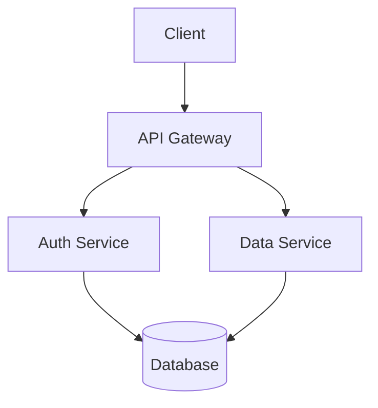
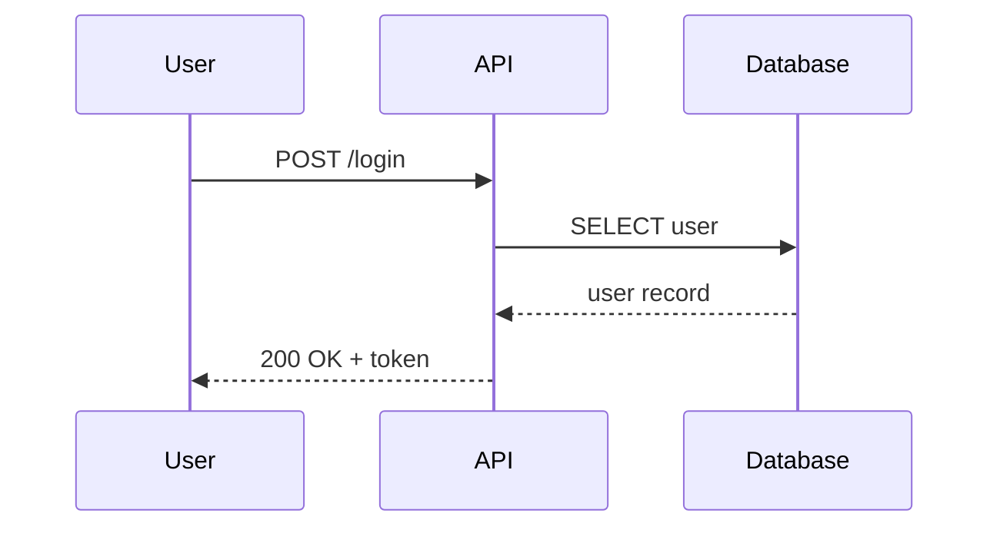

# Toolbelt for AI Assisted Confluence Page Editing

This repository contains the required tools to download Confluence pages as markdown files, let Cursor or other AI agents edit the pages, and then upload the changes back to Confluence including preserving (most) comments and mentions.

⚠️ This tool is completely Vibe coded in an afternoon. The code looks terrible and might be buggy. But it solves the problem I needed it for and the engineers in my company love it. Use at your own risk.

## Usage and Use Cases

### Initial Setup

Initialize your local environment by running `npx @tobisk/confluence-tools init`. This will:
- Initialize a git repository (if not already initialized)
- Create a `.gitignore` file with recommended entries
- Create a `.env` file with required variables and helpful comments
- Ensure `.env` is added to `.gitignore` to prevent credential leaks

Now edit the .env file with your Confluence and Jira credentials.

### Downloading Pages

You start by downloading pages from Confluence. This can be done by pasting the URL of the page into the command line or by using the pageId.

```bash
npx @tobisk/confluence-tools download https://your-domain.atlassian.net/wiki/spaces/SPACE/pages/123456/Page+Title

# Or using just the pageId:
npx @tobisk/confluence-tools download 123456

# Or with a custom file path as second argument:
npx @tobisk/confluence-tools download https://... docs/my-page.md
npx @tobisk/confluence-tools download 123456 path/to/file.md

# Or in the development mode:
npm run confluence:download /*... args*/
```

When downloading from a URL or pageId, the tool will:
- Extract the pageId from the URL
- Fetch page metadata from the Confluence API
- Create a file named `YYMMDD-Title.md` (or use your custom path if provided) where the date is the last published date
- Automatically commit the file to git

⚠️ If you want a file to be read-only, you can add the `READONLY` flag to the header. This is helpful for reference pages and templates that should not be modified.

### Uploading Changes


Then run a `npx @tobisk/confluence-tools upload` (or `npm run confluence:upload` for development) to upload the changes back to confluence. The upload command supports several modes:
- **No arguments**: Shows an interactive file selection menu (files with git changes appear first)
- **`--all` flag**: Uploads all markdown files in the current folder and subfolders
- **Explicit file paths**: Upload specific files, e.g., `upload docs/page1.md docs/page2.md`
- **`--verbose` flag**: Show detailed information about the upload process

The interactive menu shows all files with a `pageId` (excluding READONLY files), with changed files listed first.

### Create a Jira Task

Using Jira can be a hassle, especially if your company has an inflation of custom fields that all need to be set for each new task. This tool helps you create Jira tasks from the command line with the default values, e.g. Team, Project, etc. already set (Set them once in the .env file and you're good to go).

Run `npm run confluence:task` to create a new Jira issue (Task) via prompts:

- Title
- Assign to yourself (default Yes)
- Content (multiline; press Ctrl+D to submit)

Don't forget to setup the .env file with your Jira credentials and default values for the task fields.

### Disable git integration

Both download and upload commands automatically commit changes to git for version tracking. This keeps your git history in sync with Confluence. To disable this behavior, set the `NO_AUTO_COMMIT` environment variable.

## Markdown Format

Page content is stored as markdown files with a few extensions for Confluence-specific features. This means not all Confluence layouting features are supported, but the most common ones work well.

We also try to preserve inline comments as well as possible, but this behavior is not yet exhaustively tested.

### File Header

Every file starts with an HTML comment header containing page metadata. This is generated automatically on download.

```markdown
<!--
spaceId: 123456
pageId: 789012
title: My Page Title
status: green:In Progress
-->

Page content starts here...
```

| Field | Required | Description |
|-------|----------|-------------|
| `spaceId` | Yes | Confluence space ID |
| `pageId` | Yes | Confluence page ID |
| `title` | No | Override the page title on upload |
| `status` | No | Status label in format `color:Label`, e.g. `green:In Progress` |
| `READONLY` | No | Flag (no value) — file will be downloaded but never uploaded |

A read-only file looks like this:

```markdown
<!--
READONLY
spaceId: 123456
pageId: 789012
title: Reference Architecture
-->
```

### Headings

Standard markdown headings (h1 through h6):

```markdown
# Heading 1
## Heading 2
### Heading 3
#### Heading 4
##### Heading 5
###### Heading 6
```

### Paragraphs

Plain text separated by blank lines becomes paragraphs. Consecutive lines without a blank line are joined into a single paragraph.

```markdown
This is the first paragraph. It can span
multiple lines and they will be joined.

This is a second paragraph.
```

### Inline Formatting

```markdown
This is **bold text** and this is `inline code`.
```

### Links

Several link types are supported:

```markdown
<!-- External URL -->
[Atlassian](https://www.atlassian.com)

<!-- Link to another Confluence page by title (same space) -->
[Design Doc](page:Design Document)

<!-- Link to a page in a different space by title -->
[Other Doc](page:SPACEKEY:Page Title)

<!-- Link to a page by ID (cross-space, rename-proof) -->
[Architecture](pageid:123456)

<!-- Link to a local .md file (resolved to pageid: on upload) -->
[TDD - Care Import](REFS/TDD-Care-Import.md)

<!-- Link to an attachment on the current page -->
[Download Report](#attachment:report.pdf)
```

Local `.md` file links are resolved automatically on upload: the tool reads the target file's header, extracts its `pageId`, and rewrites the link to a Confluence page reference. Links are resolved relative to the current file first, then relative to the workspace root. If the target file is missing or has no `pageId`, the original link is kept unchanged (with a console warning).

### Mentions

User mentions are stored as HTML comments:

```markdown
Assigned to <!-- mention:abc-123-def @John Smith --> for review.
```

These are converted to Confluence `@mention` macros on upload and reconstructed on download.

### Images

```markdown
<!-- External image (displayed at 500px width, centered) -->


<!-- Reference an image already attached to the Confluence page -->


<!-- Image with caption (next non-blank line becomes the caption) -->

This is the caption text
```

The `#filename.png` syntax references files that are **already attached to the Confluence page** (uploaded via the Confluence UI or API). This tool does not upload local image files as attachments.

### Tables

Standard GFM (GitHub Flavored Markdown) pipe tables:

```markdown
| Feature      | Status    | Owner   |
| ------------ | --------- | ------- |
| Auth Service | Done      | Alice   |
| Data Layer   | In Review | Bob     |
| Frontend     | WIP       | Charlie |
```

Cell background colors can be preserved with inline comments:

```markdown
| Status     | Notes                          |
| ---------- | ------------------------------ |
| OK         | All good <!-- cell:bg:green --> |
| Needs Work | See below <!-- cell:bg:red -->  |
```

### Requirement Lists

Bullet lists using `REQ(ID, VERB)` syntax are automatically converted to a styled Confluence table on upload, and converted back to a bullet list on download.

```markdown
- REQ(F1, MUST): The orchestrator MUST provide a flexible API for data fetching.
- REQ(F2, MUST): The orchestrator MUST support query aggregation from multiple services.
- REQ(F3, SHOULD): The orchestrator SHOULD implement caching mechanisms.
- nREQ(F4, MAY): The system MAY support batch processing. (rejected)
```

On **upload**, this becomes a two-column Confluence table (ID | Requirement) where:
- The VERB keyword (e.g. MUST, SHOULD) is highlighted in **red bold** in the description text
- `nREQ(...)` items are rendered with the entire row struck through
- The table carries a `data-req-table` marker so it round-trips cleanly

On **download**, the tool detects the marker and converts the table back to the original bullet list format. Struck-through rows become `nREQ(...)` items.

To reject a requirement, change `REQ(` to `nREQ(` (or vice versa to un-reject). Each item must be a single line starting with `- REQ(ID, VERB): description` or `- nREQ(ID, VERB): description`.

### Table Width and Column Configuration

You can control the overall table width and individual column proportions by placing a `<!-- table:LAYOUT [SHARES] -->` comment directly before the table:

```markdown
<!-- table:full 1,2,1 -->
| Name   | Description              | Status |
| ------ | ------------------------ | ------ |
| Item A | A longer description     | Done   |
| Item B | Short                    | WIP    |
```

**Layout** controls the total table width on the Confluence page:

| Layout    | Width  | Description                   |
|-----------|--------|-------------------------------|
| `content` | 760px  | Default content-area width    |
| `wider`   | 960px  | Wider than content area       |
| `full`    | 1800px | Full page width               |

**Column shares** (optional) are comma-separated integers that set proportional column widths. In the example above, `1,2,1` means the middle column is twice as wide as the outer columns.

You can use layout alone, shares alone, or both:

```markdown
<!-- table:wider -->
| A | B |
| --- | --- |
| 1 | 2 |

<!-- table:content 2,3 -->
| Narrow | Wide |
| --- | --- |
| x | y |

<!-- table:full 1,1,3,1 -->
| ID | Type | Details | Status |
| --- | --- | --- | --- |
| 1 | Bug | Long description here | Open |
```

When downloading a page from Confluence, table width and column configuration is automatically extracted and emitted as the config comment. Tables with default content width and equal columns produce no comment.

### Lists

```markdown
<!-- Unordered list -->
- First item
- Second item
- Third item

<!-- Ordered list -->
1. Step one
2. Step two
3. Step three

<!-- Ordered list starting at a custom number -->
5. Fifth item
6. Sixth item
```

### Code Blocks

Fenced code blocks with optional language for syntax highlighting:

````markdown
```typescript
interface User {
  id: string;
  name: string;
}
```
````

Indented code blocks (4+ spaces) are also supported:

```markdown
    const x = 1;
    console.log(x);
```

### Mermaid Diagrams

Mermaid code blocks are automatically rendered as images on Confluence using [mermaid.ink](https://mermaid.ink). No Confluence plugins required.

````markdown

````

On upload, this produces a rendered diagram image visible on the Confluence page. The mermaid source is preserved in a hidden HTML comment so downloading the page reconstructs the original fenced block for local editing.

All mermaid diagram types work: flowcharts, sequence diagrams, class diagrams, state diagrams, ER diagrams, Gantt charts, etc.

````markdown

````

**Note:** Rendering requires internet access. The source code is always preserved regardless of service availability.

### Blockquotes

```markdown
> This is a simple blockquote.
> It can span multiple lines.
```

### Info Panels

Confluence info/warning/note/tip panels use a special comment tag inside a blockquote:

```markdown
<!-- Info panel (blue) -->
> <!-- panel:info:info -->
> This is an informational message.

<!-- Warning panel (yellow) -->
> <!-- panel:warning:warning -->
> Be careful with this operation.

<!-- Note panel -->
> <!-- panel:note:note -->
> Keep this in mind.

<!-- Tip panel (green) -->
> <!-- panel:tip:tip -->
> Here's a useful tip.

<!-- Success panel -->
> <!-- panel:success:success -->
> The deployment was successful.

<!-- Error panel -->
> <!-- panel:error:error -->
> Something went wrong.

<!-- Generic panel with custom background color -->
> <!-- panel:#f0f0f0:panel -->
> Panel with a custom background color.
```

### Status Tags

Inline status labels (colored badges):

```markdown
<!-- status:green:Done -->
<!-- status:yellow:In Progress -->
<!-- status:red:Blocked -->
<!-- status:grey:To Do -->
```

### Table of Contents

```markdown
<!-- widget:TOC -->
```

This generates a Confluence Table of Contents macro that automatically lists all headings on the page.

### Horizontal Rules

```markdown
-------
```

Use seven hyphens for a horizontal rule (separator line).

### Inline Comments

Confluence inline comments are preserved using paired HTML comment tags:

```markdown
This has <!-- comment:abc123 -->commented text<!-- commend-end:abc123 --> in it.
```

These round-trip through download/upload and map to Confluence's inline comment markers.

### Node ID Tags

When you download a page, each content block gets a node ID tag. These enable partial updates — only the blocks you changed get updated on the remote page, leaving other content untouched.

```markdown
<!-- node:a1b2c3d4 -->
## Section Title

<!-- node:e5f6g7h8 -->
This paragraph has its own node ID.
```

These tags should not be removed. If all node IDs are present, upload performs a surgical partial update. If any are missing, the tool falls back to a full page replacement.

