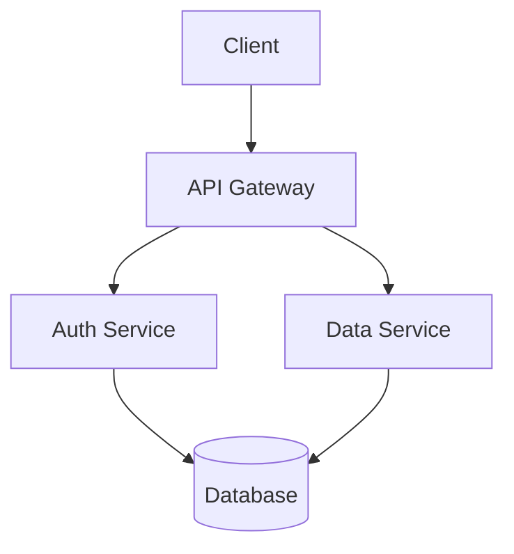
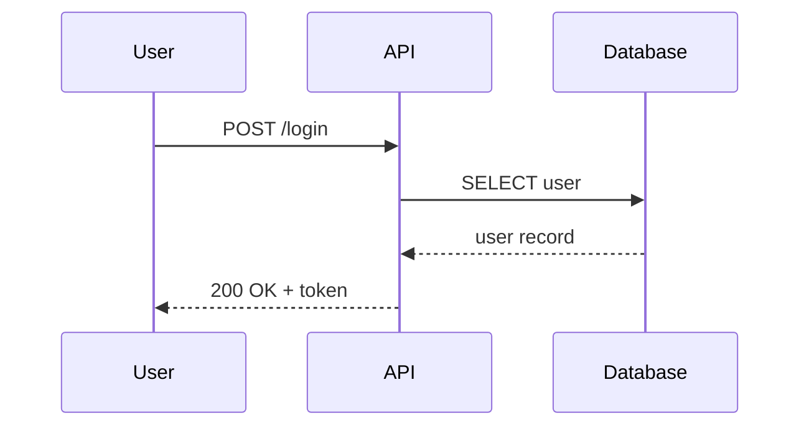

# Toolbelt for AI Assisted Confluence Page Editing

Edit Confluence pages as markdown — in Obsidian, or from the command line with Cursor and other AI agents — and publish them back with comments, mentions and formatting intact.

The **[Obsidian plugin](#obsidian-plugin)** is the main way to use this. It brings the whole download/edit/upload workflow into your vault on desktop **and** mobile, in Obsidian-native markdown: properties, callouts, `%%` comments, wikilink and embed translation, locally rendered diagrams, and a git-free version-based merge.

The **[CLI](#cli)** covers the same ground from a terminal, and is the right tool for scripting, bulk operations, and pointing an AI agent at a folder of pages. Both share one conversion core, so a page round-trips the same way through either.

This tool is largely vibe coded. It solves the problem I needed it for, and the engineers in my company use it daily.

## Obsidian Plugin

The plugin lives in the same repo and is built to `plugin-dist/` (`main.js` + `manifest.json` + `versions.json`). Every GitHub release attaches these as assets, so you can install it straight from GitHub.


The side panel shows the sync state of the current note — whether it is up to date with Confluence, its version, and when it last synced — alongside the actions you need most.

### Install with BRAT (recommended)

1. Install the **BRAT** community plugin in Obsidian (Community plugins → search "BRAT").
2. BRAT → *Add a beta plugin* → enter `kellertobias/confluence-toolbelt`.
3. Enable **Confluence Tools** in Community plugins. BRAT keeps it updated from new GitHub releases.

### Manual install

Download `main.js` and `manifest.json` from the [latest release](https://github.com/kellertobias/confluence-toolbelt/releases/latest), drop them into `<vault>/.obsidian/plugins/confluence-tools/`, and enable the plugin.

### Build from source

```bash
npm ci
npm run build:plugin          # → plugin-dist/{main.js,manifest.json,versions.json}
# copy plugin-dist/ into <vault>/.obsidian/plugins/confluence-tools/
npm run dev:plugin            # watch mode while developing
```

### Configure & use

Set your Confluence base URL, email, and API token in the plugin's settings (replaces the CLI's `.env`). A **Diagram theme** setting there (default **dark**) picks the palette for mermaid and Excalidraw diagrams rendered on upload — one setting for both, so the diagrams on a page match each other. It applies on the next upload of a note; already-published diagrams keep the theme they were rendered with until that note is uploaded again. Then run the commands from the command palette: **Download Confluence page**, **Download Confluence page tree**, **Upload current note to Confluence**, **Search Confluence and download**, **Test Confluence connection**.

**Download Confluence page tree** (also a button in the side panel) takes a page URL or ID and
pulls that page plus every child page you can access. You pick the destination folder from a
dropdown of the vault's folders, and how many levels to follow. Children are written into a
folder named after their parent note, mirroring the Confluence hierarchy:

```
Handbook.md
Handbook/
  Onboarding.md
  Onboarding/
    Week One.md
```

Notes already in the vault for those pages are refreshed in place rather than duplicated. Notes
you have edited since their last sync are skipped and listed afterwards — turn on **Overwrite
local changes** in the dialog if you want a hard reset from Confluence instead.

Releases are produced by [`@semantic-release`](.releaserc.json) on every push to `main`: it computes the version from Conventional Commits, syncs `manifest.json`/`versions.json` ([version-bump.mjs](version-bump.mjs)), bundles the plugin, and attaches the assets to the GitHub release. CI ([.github/workflows/ci.yml](.github/workflows/ci.yml)) builds, tests, type-checks, and bundles the plugin (including a node-builtin guard for mobile-safety) on every PR.

## CLI

### Initial Setup

Initialize your local environment by running `npx @tobisk/confluence-tools init`. This will:
- Initialize a git repository (if not already initialized)
- Create a `.gitignore` file with recommended entries
- Create a `.env` file with required variables and helpful comments
- Ensure `.env` is added to `.gitignore` to prevent credential leaks

Now edit the .env file with your Confluence and Jira credentials.

### Downloading Pages

You start by downloading pages from Confluence. This can be done by pasting the URL of the page into the command line or by using the pageId.

```bash
npx @tobisk/confluence-tools download https://your-domain.atlassian.net/wiki/spaces/SPACE/pages/123456/Page+Title

# Or using just the pageId:
npx @tobisk/confluence-tools download 123456

# Or with a custom file path as second argument:
npx @tobisk/confluence-tools download https://... docs/my-page.md
npx @tobisk/confluence-tools download 123456 path/to/file.md

# Or in the development mode:
npm run confluence:download /*... args*/
```

When downloading from a URL or pageId, the tool will:
- Extract the pageId from the URL
- Fetch page metadata from the Confluence API
- Create a file named `YYMMDD-Title.md` (or use your custom path if provided) where the date is the last published date
- Automatically commit the file to git

To make a file read-only, add the `READONLY` flag to the header. This is helpful for reference pages and templates that should not be modified.

### Downloading a Whole Page Tree

To pull a page together with every child page you have access to, add `--tree` (or use the
`download-tree` spelling):

```bash
# Downloads the page and all descendants into the current folder
npx @tobisk/confluence-tools download --tree https://your-domain.atlassian.net/wiki/spaces/SPACE/pages/123456/Page+Title

# Same thing, by pageId, into a target folder
npx @tobisk/confluence-tools download-tree 123456 docs/handbook

# Only the page and its direct children
npx @tobisk/confluence-tools download-tree 123456 --depth 1
```

The hierarchy is mirrored on disk — a page becomes `<Title>.md`, and its children live in a
folder named after it:

```
Handbook.md
Handbook/
  Onboarding.md
  Onboarding/
    Week-One.md
  Tooling.md
```

Pages already downloaded elsewhere in the folder are refreshed **in place** (matched by their
`pageId` header) instead of being duplicated into the tree, and their children are placed
relative to where they actually live.

**Local changes are never overwritten silently.** Before replacing an existing file, the tool
compares it against the markdown it last wrote (kept in a hidden `.<name>.base.md` sidecar,
falling back to git `HEAD`). Files that are provably unchanged are updated; files with local
edits — or files the tool has no baseline for, such as hand-written notes — are skipped and
listed at the end of the run. Pass `--force` to overwrite them anyway.

### Syncing Changes

`sync` is newer than `download`/`upload` and has seen less mileage.

`sync` is the recommended workflow when you edit a page locally while others may be commenting or editing it on Confluence at the same time. It performs a three-way merge (your local edits + new remote comments/edits + the last-known base) and then uploads the result.

```bash
npx @tobisk/confluence-tools sync              # interactive file picker
npx @tobisk/confluence-tools sync page.md     # sync a specific file
npx @tobisk/confluence-tools sync --all       # sync every tracked file
npx @tobisk/confluence-tools sync --no-upload # merge only, skip upload
npx @tobisk/confluence-tools sync --verbose   # show detailed progress
```

**How it works:**

1. Pulls the current remote page and its inline comments from Confluence.
2. Loads the last-known remote state from a hidden sidecar file (`.page.md.base.confluence`). Falls back to the git HEAD version, and further falls back to a simpler 2-way merge with a warning if neither is available.
3. Three-way merges each block:
   - **Only you changed it** → keep your edit, reattach any remote comments whose anchor text is still present.
   - **Only remote changed** → accept the remote version (picks up new edits and comments).
   - **Both changed the same way** → accept the remote version.
   - **Both changed differently** → emit git-style conflict markers; upload is skipped until you resolve them.
4. Comments whose anchor text was deleted locally are moved to a `# Detached Comments` section at the end of the file so you don't lose them.
5. Writes the merged file, refreshes the sidecar, commits it, and uploads (unless `--no-upload`).

**Conflict resolution:**

When a conflict is detected you'll see `<<<<<<< LOCAL` / `>>>>>>> REMOTE` markers in the file, just like a git merge conflict. Edit the file to resolve them (delete the markers and keep the text you want), then run `sync` again.

**Detached comments:**

When a comment's anchor text no longer exists in your local version, it's moved to a trailing section rather than discarded:

```markdown
# Detached Comments

- <!-- comment:abc123 --><!-- # Alice: We should rephrase this -->Alice @ Section Title<!-- commend-end:abc123 -->
```

You can re-anchor a detached comment by moving the `<!-- comment:... -->...<!-- commend-end:... -->` pair to the relevant text in the document body, then running `sync --no-upload` or uploading manually.

**Sidecar files:**

`sync` and `download` both write a hidden sidecar file (`.page.md.base.confluence`) alongside each markdown file. This file stores the raw Confluence storage HTML from the last pull and is used as the merge base. It is listed in `.gitignore` by `init` and should never be committed.

### Uploading Changes


Then run a `npx @tobisk/confluence-tools upload` (or `npm run confluence:upload` for development) to upload the changes back to confluence. The upload command supports several modes:
- **No arguments**: Shows an interactive file selection menu (files with git changes appear first)
- **`--all` flag**: Uploads all markdown files in the current folder and subfolders
- **Explicit file paths**: Upload specific files, e.g., `upload docs/page1.md docs/page2.md`
- **`--verbose` flag**: Show detailed information about the upload process

The interactive menu shows all files with a `pageId` (excluding READONLY files), with changed files listed first.

### Creating New Pages

You can create new Confluence pages directly from the CLI. There are two non-interactive modes driven by an existing local markdown file whose header has a `pageId`:

```bash
# Create a new page that is a SIBLING of the source page (same parent)
npx @tobisk/confluence-tools create sibling docs/existing.md docs/new-sibling.md

# Create a new page that is a CHILD of the source page
npx @tobisk/confluence-tools create child docs/existing.md docs/new-child.md

# Override the derived page title
npx @tobisk/confluence-tools create child docs/existing.md docs/api-guide.md --title "API Guide"
```

Both commands will:
- Read the source file's header to resolve its `pageId` and `spaceId`
- Look up the source page on Confluence to determine its parent (for `sibling`) or use it as parent (for `child`)
- Create a new empty page in the same space
- Write a new markdown file at the target path containing only the header with the new `pageId`, `spaceId`, and `title`
- Automatically commit the new file to git (unless `NO_AUTO_COMMIT` is set)

If `--title` is not provided, the title is derived from the target filename (dashes and underscores become spaces, words are capitalized). For example, `new-api-guide.md` becomes `New Api Guide`.

You can also still run `npx @tobisk/confluence-tools create` with no subcommand to launch an interactive wizard that prompts for parent URL, space ID, and title.

### Create a Jira Task

Using Jira can be a hassle, especially if your company has an inflation of custom fields that all need to be set for each new task. This tool helps you create Jira tasks from the command line with the default values, e.g. Team, Project, etc. already set (Set them once in the .env file and you're good to go).

Run `npm run confluence:task` to create a new Jira issue (Task) via prompts:

- Title
- Assign to yourself (default Yes)
- Content (multiline; press Ctrl+D to submit)

Don't forget to setup the .env file with your Jira credentials and default values for the task fields.

### Disable git integration

Both download and upload commands automatically commit changes to git for version tracking. This keeps your git history in sync with Confluence. To disable this behavior, set the `NO_AUTO_COMMIT` environment variable.

### Dash Normalization on Upload

When uploading, unicode dashes are automatically replaced with a regular ASCII hyphen `-` in both the page body and the page title. This keeps pages clean of smart-quote-style autocorrections that sneak in from editors or copy/paste.

Characters that get normalized:

- `—` em dash (U+2014)
- `–` en dash (U+2013)
- `‒` figure dash (U+2012)
- `―` horizontal bar (U+2015)
- `‐` hyphen (U+2010)
- `‑` non-breaking hyphen (U+2011)
- `−` minus sign (U+2212)

To keep the original dashes as-is, set `EM_DASH=1` in your `.env` file.

## Markdown Format

Page content is stored as markdown files with a few extensions for Confluence-specific features. This means not all Confluence layouting features are supported, but the most common ones work well.

We also try to preserve inline comments as well as possible, but this behavior is not yet exhaustively tested.

### File Header

Every file starts with an HTML comment header containing page metadata. This is generated automatically on download.

```markdown
<!--
spaceId: 123456
pageId: 789012
title: My Page Title
status: green:In Progress
-->

Page content starts here...
```

| Field | Required | Description |
|-------|----------|-------------|
| `spaceId` | Yes | Confluence space ID |
| `pageId` | Yes | Confluence page ID |
| `title` | No | Override the page title on upload |
| `status` | No | Status label in format `color:Label`, e.g. `green:In Progress` |
| `READONLY` | No | Flag (no value) — file will be downloaded but never uploaded |

A read-only file looks like this:

```markdown
<!--
READONLY
spaceId: 123456
pageId: 789012
title: Reference Architecture
-->
```

### Headings

Standard markdown headings (h1 through h6):

```markdown
# Heading 1
## Heading 2
### Heading 3
#### Heading 4
##### Heading 5
###### Heading 6
```

### Paragraphs

Plain text separated by blank lines becomes paragraphs. Consecutive lines without a blank line are joined into a single paragraph.

```markdown
This is the first paragraph. It can span
multiple lines and they will be joined.

This is a second paragraph.
```

### Inline Formatting

```markdown
This is **bold text** and this is `inline code`.
```

### Links

Several link types are supported:

```markdown
<!-- External URL -->
[Atlassian](https://www.atlassian.com)

<!-- Link to another Confluence page by title (same space) -->
[Design Doc](page:Design Document)

<!-- Link to a page in a different space by title -->
[Other Doc](page:SPACEKEY:Page Title)

<!-- Link to a page by ID (cross-space, rename-proof) -->
[Architecture](pageid:123456)

<!-- Link to a local .md file (resolved to pageid: on upload) -->
[TDD - Care Import](REFS/TDD-Care-Import.md)

<!-- Link to an attachment on the current page -->
[Download Report](#attachment:report.pdf)
```

Local `.md` file links are resolved automatically on upload: the tool reads the target file's header, extracts its `pageId`, and rewrites the link to a Confluence page reference. Links are resolved relative to the current file first, then relative to the workspace root. If the target file is missing or has no `pageId`, the original link is kept unchanged (with a console warning).

### Mentions

User mentions are stored as HTML comments:

```markdown
Assigned to <!-- mention:abc-123-def @John Smith --> for review.
```

These are converted to Confluence `@mention` macros on upload and reconstructed on download.

### Images

```markdown
<!-- Local image file (uploaded as a page attachment on upload) -->


<!-- External image (displayed at 500px width, centered) -->


<!-- Reference an image already attached to the Confluence page -->


<!-- Image with caption (next non-blank line becomes the caption) -->

This is the caption text
```

**Local image files are uploaded automatically on upload.** When an image src is
a local file path (relative to the markdown file, with a fallback to the
workspace root), the tool uploads the file as an attachment on the target page
and rewrites the reference to the `#filename` attachment scheme so it renders
correctly. Supported formats: **PNG, JPG/JPEG, SVG**, plus GIF, WebP, and BMP.

On each upload, an image is only re-uploaded if its content changed: a SHA-256
of every uploaded file is recorded per page in a local `.attachments.json`
cache, and unchanged images are skipped to avoid attachment-version churn. A
changed image is re-uploaded, updating the existing attachment in place (a new
version). The cache is a per-user optimisation (gitignored by `init`); delete
`.attachments.json` to force every referenced image to upload again — useful if
you removed an attachment in the Confluence UI by hand.

Round-tripping: on download, attached images come back as ``,
which re-uploads to the same attachment. The image stays correct across
download/upload cycles. (Downloading does not copy the attachment binary back to
a local file — the reference points at the Confluence attachment.)

**Editing an image after a round-trip still works.** The `#filename.png` syntax
references an attachment on the page, but on upload the tool also looks for a
local file named `filename.png` — first under the markdown file's own folder
(e.g. `assets/filename.png`), then anywhere in the workspace. If it finds one, it
keeps the attachment in sync with that file (uploading only when the bytes
changed). So after `download` rewrites `` to ``, you
can keep editing `assets/x.png` locally and your changes upload as usual. If no
local file matches, `#filename.png` simply references the existing attachment
(uploaded earlier by this tool, the Confluence UI, or the API), unchanged.

If a referenced local file is missing or has an unsupported extension, the
reference is left unchanged and a warning is printed.

### Tables

Standard GFM (GitHub Flavored Markdown) pipe tables:

```markdown
| Feature      | Status    | Owner   |
| ------------ | --------- | ------- |
| Auth Service | Done      | Alice   |
| Data Layer   | In Review | Bob     |
| Frontend     | WIP       | Charlie |
```

Cell background colors can be preserved with inline comments:

```markdown
| Status     | Notes                          |
| ---------- | ------------------------------ |
| OK         | All good <!-- cell:bg:green --> |
| Needs Work | See below <!-- cell:bg:red -->  |
```

### Requirement Lists

Bullet lists using `REQ(ID, VERB)` syntax are automatically converted to a styled Confluence table on upload, and converted back to a bullet list on download.

```markdown
- REQ(F1, MUST): The orchestrator MUST provide a flexible API for data fetching.
- REQ(F2, MUST): The orchestrator MUST support query aggregation from multiple services.
- REQ(F3, SHOULD): The orchestrator SHOULD implement caching mechanisms.
- nREQ(F4, MAY): The system MAY support batch processing. (rejected)
```

On **upload**, this becomes a two-column Confluence table (ID | Requirement) where:
- The VERB keyword (e.g. MUST, SHOULD) is highlighted in **red bold** in the description text
- `nREQ(...)` items are rendered with the entire row struck through
- The table carries a `data-req-table` marker so it round-trips cleanly

On **download**, the tool detects the marker and converts the table back to the original bullet list format. Struck-through rows become `nREQ(...)` items.

To reject a requirement, change `REQ(` to `nREQ(` (or vice versa to un-reject). Each item must be a single line starting with `- REQ(ID, VERB): description` or `- nREQ(ID, VERB): description`.

### Definition Lists

Two-column tables that map a short key to a longer description (glossaries, role lists, field references, etc.) can be written as a bullet list with a `<!-- deflist ... -->` preamble. On upload, the list is rendered as a styled Confluence table and carries enough metadata to round-trip cleanly on download.

```markdown
<!-- deflist keyword="ROLE" columns=Role,Name -->
- ROLE(Owner/Writer): Tobias S. Keller
- ROLE(Product Manager):
- ROLE(Technical Reviewer):

<!-- deflist keyword="TERM" columns=Term,Definition -->
- TERM(Facade): A design pattern serving as a front-facing interface
  masking more complex underlying code.
- TERM(Adapter): A wrapper that converts one interface to another.
```

The `keyword` attribute selects which bullet items belong to the list (items not starting with `KEYWORD(...)` end the block). The `columns` attribute provides the table header labels. Quote the value when a label contains spaces or commas:

```markdown
<!-- deflist keyword="FIELD" columns="Field Name,Value" -->
- FIELD(Project): Confluence Tools
- FIELD(Owner): Tobias S. Keller
```

**Multi-line values** are supported via indented continuation lines — additional indented lines after a bullet item are merged into the same cell and rendered as `<br/>` on the Confluence page.

On **upload**, the list becomes a `<table data-deflist="true" data-deflist-keyword="..." data-deflist-columns="...">` element. On **download**, the tool detects the marker and reconstructs the original comment and bullet list format.

### List Tables

An alternative table representation that uses key-value rows instead of pipe-delimited cells. This is useful when columns have different content types (lists, long text) or when you want a more readable row-oriented format in markdown.

```markdown
<!-- list-table columns=programFamily:"Program Family",businessUnit:"Business Unit",characteristics:"Characteristics",amountStudents:"Amount Students" spacing=1,2,2,5 -->

programFamily: FS
businessUnit: Distance Learning
amountStudents: 140.000
characteristics:
  - Mainly Managed in EPOS
  - use MyCampus
  - Write online Exams

---

programFamily: EU
businessUnit: Distance Learning
amountStudents: 40.000
characteristics:
  - Online Students
  - Mainly Managed in EPOS
  - use MyCampus
  - Write online Exams

<!-- /list-table -->
```

- The `columns=` attribute defines each column with `key:"Header Label"`. Keys are used in rows to assign values; headers appear in the Confluence table.
- `spacing=` (optional) sets relative column widths, e.g. `spacing=1,2,2,5`.
- Rows are separated by `---`.
- Each row lists `key: value` pairs. The order within a row does not matter — keys determine which column the value belongs to.
- List values are written as indented `- item` bullets under an empty `key:` line.
- Multi-line text values are supported via indented continuation lines.

**Merged cells** are supported with a `merge(...)` directive at the start of a row:

```markdown
<!-- list-table columns=programFamily:"Program Family",businessUnit:"Business Unit",characteristics:"Characteristics",amountStudents:"Amount Students" -->

merge(programFamily,businessUnit,amountStudents,characteristics)

businessUnit: Distance Learning

---

programFamily: FS
businessUnit: Distance Learning
amountStudents: 140.000
characteristics:
  - Mainly Managed in EPOS

<!-- /list-table -->
```

This produces a single merged cell spanning all four columns for the first row.

On **upload**, the block becomes a Confluence `<table>` with `data-list-table` markers and a hidden expand macro so the configuration survives Confluence's data-* attribute stripping. On **download**, the table is reconstructed back into the original comment + key-value format.

### Table Width and Column Configuration

You can control the overall table width and individual column proportions by placing a `<!-- table:LAYOUT [SHARES] -->` comment directly before the table:

```markdown
<!-- table:full 1,2,1 -->
| Name   | Description              | Status |
| ------ | ------------------------ | ------ |
| Item A | A longer description     | Done   |
| Item B | Short                    | WIP    |
```

**Layout** controls the total table width on the Confluence page:

| Layout    | Width  | Description                   |
|-----------|--------|-------------------------------|
| `content` | 760px  | Default content-area width    |
| `wider`   | 960px  | Wider than content area       |
| `full`    | 1800px | Full page width               |

**Column shares** (optional) are comma-separated integers that set proportional column widths. In the example above, `1,2,1` means the middle column is twice as wide as the outer columns.

You can use layout alone, shares alone, or both:

```markdown
<!-- table:wider -->
| A | B |
| --- | --- |
| 1 | 2 |

<!-- table:content 2,3 -->
| Narrow | Wide |
| --- | --- |
| x | y |

<!-- table:full 1,1,3,1 -->
| ID | Type | Details | Status |
| --- | --- | --- | --- |
| 1 | Bug | Long description here | Open |
```

When downloading a page from Confluence, table width and column configuration is automatically extracted and emitted as the config comment. Tables with default content width and equal columns produce no comment.

### Lists

```markdown
<!-- Unordered list -->
- First item
- Second item
- Third item

<!-- Ordered list -->
1. Step one
2. Step two
3. Step three

<!-- Ordered list starting at a custom number -->
5. Fifth item
6. Sixth item
```

### Code Blocks

Fenced code blocks with optional language for syntax highlighting:

````markdown
```typescript
interface User {
  id: string;
  name: string;
}
```
````

Indented code blocks (4+ spaces) are also supported:

```markdown
    const x = 1;
    console.log(x);
```

### Excalidraw Diagrams (Obsidian plugin only)

Excalidraw drawings embedded in a note are rendered to PNG and attached to the
Confluence page on upload:

```markdown
![[Architecture.excalidraw]]
```

becomes an `Architecture.png` attachment shown inline on the page. The drawing
source is uploaded alongside it as `Architecture.excalidraw.md`, so the editable
original travels with the page and can be dropped into another vault.

**Your local link survives the round-trip.** Confluence only ever sees the PNG,
but the mapping `Architecture.png → Architecture.excalidraw` is recorded in the
note's sidecar, so downloading the page restores `![[Architecture.excalidraw]]`
rather than leaving the note pointing at the render. The rendered PNG is never
written into your vault, and any size hint (`![[Architecture.excalidraw|400]]`)
is preserved. Someone else downloading the same page has no such mapping and
correctly keeps `![[Architecture.png]]` — they have no drawing to link to.

Rendering goes through the [Excalidraw
plugin](https://github.com/zsviczian/obsidian-excalidraw-plugin)'s own
`ExcalidrawAutomate` API rather than a bundled copy of Excalidraw, so what
Confluence receives is exactly what you see in your vault. Images are rendered
at 2× scale on a light theme (Confluence pages are light), and re-uploaded only
when the drawing actually changed.

Where Excalidraw isn't available — mobile, or the plugin disabled — the
behaviour depends on whether the page already has an image:

- **Already uploaded once:** the existing attachment is reused untouched and the
  upload proceeds. Editing a page's text from your phone never destroys a
  diagram rendered on desktop.
- **Never uploaded:** the upload stops with a notice naming the drawings, rather
  than publishing a page with missing diagrams. Upload once from a desktop vault
  with Excalidraw enabled; after that, edits from anywhere are fine.

This is plugin-only — the CLI has no Excalidraw to render with, and leaves such
embeds untouched.

### Mermaid Diagrams

Mermaid code blocks are automatically rendered as images on Confluence. No Confluence plugins required.

**In the Obsidian plugin** the diagram is rendered locally, using a bundled mermaid, and uploaded as a page attachment — so the published page is self-contained. **The CLI** has no browser to rasterize with and emits an image URL pointing at [mermaid.ink](https://mermaid.ink) instead, which carries the diagram source in the URL and is re-fetched by Confluence on each page view. The plugin uses the same URL as a fallback if a diagram fails to render, so a broken diagram costs the local rendering rather than the upload.

````markdown

````

On upload, this produces a rendered diagram image visible on the Confluence page. The mermaid source is preserved alongside it (in a collapsed "Mermaid Diagram Source" section) so downloading the page reconstructs the original fenced block for local editing — the image itself is never written into the vault.

All mermaid diagram types work: flowcharts, sequence diagrams, class diagrams, state diagrams, ER diagrams, Gantt charts, etc.

````markdown

````

**Note:** Rendering requires internet access. The source code is always preserved regardless of service availability.

### Blockquotes

```markdown
> This is a simple blockquote.
> It can span multiple lines.
```

### Info Panels

Confluence info/warning/note/tip panels use a special comment tag inside a blockquote:

```markdown
<!-- Info panel (blue) -->
> <!-- panel:info:info -->
> This is an informational message.

<!-- Warning panel (yellow) -->
> <!-- panel:warning:warning -->
> Be careful with this operation.

<!-- Note panel -->
> <!-- panel:note:note -->
> Keep this in mind.

<!-- Tip panel (green) -->
> <!-- panel:tip:tip -->
> Here's a useful tip.

<!-- Success panel -->
> <!-- panel:success:success -->
> The deployment was successful.

<!-- Error panel -->
> <!-- panel:error:error -->
> Something went wrong.

<!-- Generic panel with custom background color -->
> <!-- panel:#f0f0f0:panel -->
> Panel with a custom background color.
```

**In the Obsidian plugin**, panels are callouts. The two are matched by colour
rather than by name, because the vocabularies reuse the same words for
different colours — Confluence's `note` is the yellow box, and its `warning` is
red:

| Obsidian callout | Confluence panel | Colour |
| --- | --- | --- |
| `[!info]` | `info` | blue |
| `[!warning]` | `note` | yellow |
| `[!tip]` | `success` | green |
| `[!danger]` | `error` | red |
| `[!note]` | plain `panel` | none |

Obsidian's aliases work too — `caution`/`question` land on yellow,
`hint`/`check`/`done` on green, `error`/`failure`/`bug` on red. Confluence's
legacy `tip` and `warning` macros come down as `[!tip]` and `[!danger]`, and
keep their exact type in a `%%cf:…%%` marker so re-uploading doesn't silently
recolour them.

### Expand / Collapse Sections

Wrap any block content in a pair of delimiters to get Confluence's `expand`
macro — the verdict stays visible, the evidence collapses:

```markdown
<!-- expand:How we measured this -->
Arbitrary markdown goes here: paragraphs, lists, tables, code blocks.

| Metric | Value |
| --- | --- |
| p95  | 210ms |
<!-- /expand -->
```

The title after the colon is optional (`<!-- expand -->` renders an untitled
section). Expands can be nested. The body is rendered through the same pipeline
as the rest of the page, so everything that works at the top level works inside
a collapsed section, and it round-trips back to the same delimiters on download.

One limitation: an expand nested inside a table cell or a panel body cannot be
represented in markdown. Upload warns about those, and they are flattened.

**In the Obsidian plugin**, the delimiters are a foldable callout instead —
Obsidian renders an HTML comment as nothing at all, so a page of expands would
otherwise arrive as a wall of prose with its structure invisible:

```markdown
> [!expand]- How we measured this
> Arbitrary markdown goes here: paragraphs, lists, tables, code blocks.
```

The `-` means "starts collapsed", the way Confluence renders it; change it to
`+` to have the section start open, and it still uploads as an expand. The body
is quoted one level rather than flattened, so tables, code fences, panels and
nested expands inside a section keep working as themselves. The CLI keeps the
comment delimiters — the canonical form is unchanged, so the two round-trip
against the same pages.

### Status Tags

Inline status labels (colored badges):

```markdown
<!-- status:green:Done -->
<!-- status:yellow:In Progress -->
<!-- status:red:Blocked -->
<!-- status:grey:To Do -->
```

### Table of Contents

```markdown
<!-- widget:TOC -->
```

This generates a Confluence Table of Contents macro that automatically lists all headings on the page.

### Horizontal Rules

```markdown
-------
```

Use seven hyphens for a horizontal rule (separator line).

### Inline Comments

Confluence inline comments are preserved using paired HTML comment tags:

```markdown
This has <!-- comment:abc123 --><!-- # John Doe: I think we should rephrase this -->commented text<!-- commend-end:abc123 --> in it.
```

These tags round-trip through download/upload and map to Confluence's inline comment markers.

When downloading, the tool also fetches the actual comment text and author and embeds them as a separate `<!-- # Author: Text -->` comment directly after the marker tag to give you context during editing. These injected text comments are automatically stripped when uploading to avoid cluttering the Confluence page.

When using `sync`, comments whose anchor text was deleted locally are moved to a `# Detached Comments` section at the end of the file rather than lost. See the [Syncing Changes](#syncing-changes) section for details.

### Node ID Tags

When you download a page, each content block gets a node ID tag. These enable partial updates — only the blocks you changed get updated on the remote page, leaving other content untouched.

```markdown
<!-- node:a1b2c3d4 -->
## Section Title

<!-- node:e5f6g7h8 -->
This paragraph has its own node ID.
```

These tags should not be removed. If all node IDs are present, upload performs a surgical partial update. If any are missing, the tool falls back to a full page replacement.
